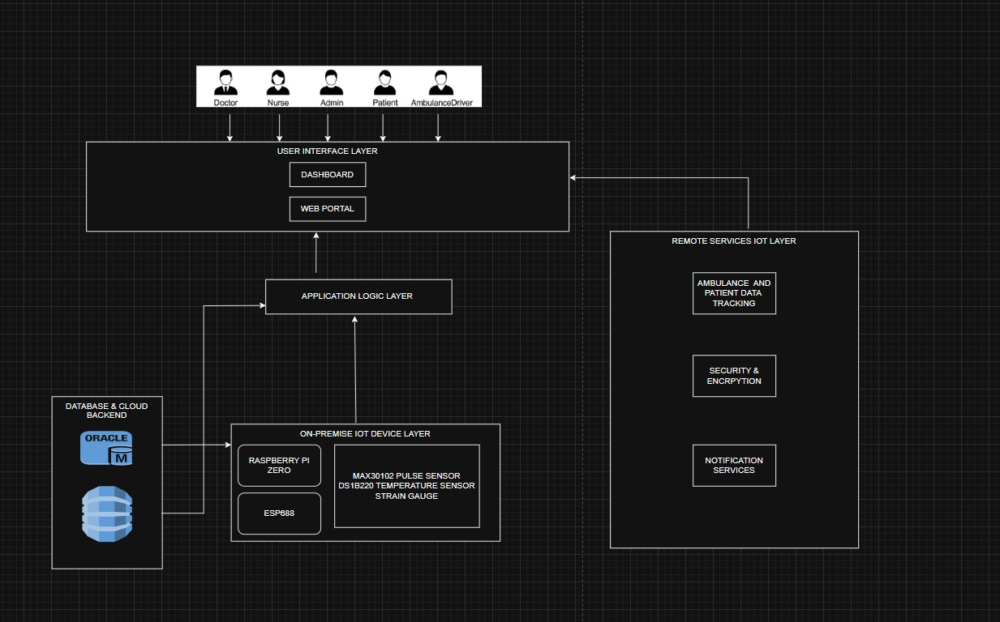

# Integrated Hospital Management System (ihms) 🏥

IHMS is a smart, integrated healthcare solution aimed at digitizing and optimizing hospital workflows, especially in remote or under-resourced regions. It combines IoT-based patient monitoring, real-time ambulance tracking, and a web-based dashboard, all backed by a secure cloud infrastructure.

---

## 🚀 Features

- 🔬 Real-time vitals monitoring using Raspberry Pi & sensors (MAX30102, DS18B20, etc.)
- 🚑 GPS-based ambulance tracking with live ETA
- 📊 Responsive dashboard for healthcare professionals
- ☁️ Backend powered by Flask on AWS EC2
- 🔐 Data privacy and encryption in transit
- 🧩 Designed for FHIR compatibility for healthcare integration

---

## 📁 Project Structure

```
IHMS/
├── backend/            # Flask API and cloud integration
├── dashboard/          # Frontend files for the web dashboard
├── iot/                # Sensor interfacing and Raspberry Pi code
├── diagrams/           # System architecture and circuit diagrams
├── docs/               # Project documentation
├── requirements.txt    # Python dependencies
└── README.md
```

---

## 🛠️ Tech Stack

- **Hardware**: Raspberry Pi Zero W, MAX30102, DS18B20, ESP8266
- **Backend**: Python, Flask, AWS EC2, MQTT
- **Frontend**: HTML, CSS, JS (or React if extended)
- **Database**: AWS RDS or DynamoDB (depending on use)
- **Dashboard Hosting**: S3 + CloudFront / EC2
- **Standards**: FHIR for data compatibility

---

## 🔧 Setup Instructions

1. Clone this repository:
```bash
git clone https://github.com/dmlwaW4K/IHMS.git
cd IHMS
```

2. Install dependencies:
```bash
pip install -r requirements.txt
```

3. Start the backend server:
```bash
cd backend
python api_server.py
```

4. (Optional) Serve dashboard via local server or upload to S3.

---

## 📌 Project Board

Track our progress: [GitHub Project Board](https://github.com/your-username/IHMS/projects)

---

## 📷 Architecture



---

## 🤝 Contributing

Pull requests are welcome. For major changes, open an issue first to discuss what you would like to change.

---

## 📝 License

This project is licensed under the MIT License.

